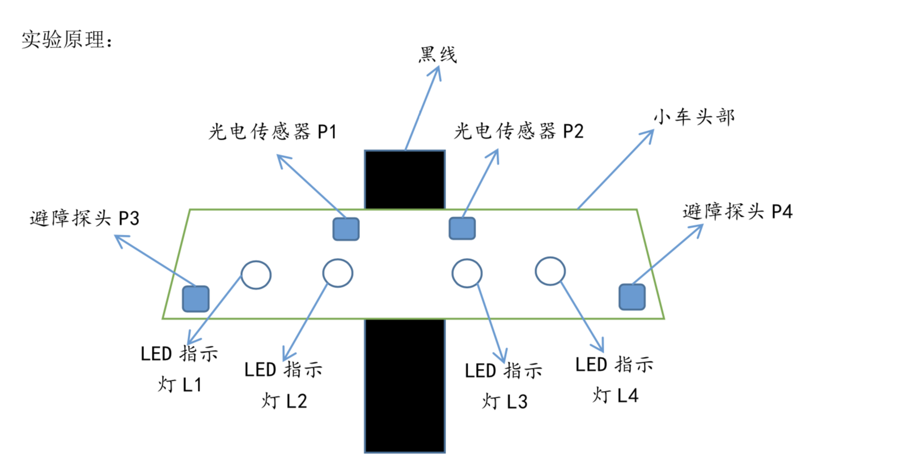
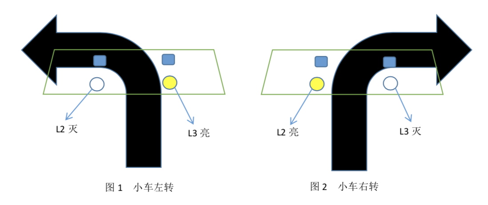

# AICar（3）

@2015202004  @2015202008  @2015202031  @2015202037

-------------------
## 黑线循迹部分&超声波避障

#### 扩展使用器材：
- 四个提示灯
- 两个光敏电阻

> 提示灯用于显示小车运行状况，光敏电阻用于调整小车对于轨道的识别灵敏度

#### 实验原理

> 当光电传感器P1下方为黑线时，LED指示灯L2灭，否则L2亮；同理，当光电传感器P2下方为黑线时，LED指示灯L3灭，否则L3亮。
- L2亮，L3亮，小车直行；
- L2灭，L3亮，小车左转（见下图1）
- L2亮，L3灭，小车右转（见下图2）
- L2灭，L3灭，小车停止。

> 当避障探头 P3 探测到障碍物距离小于 10cm 时，LED 指示灯 L1 亮，否则灭;同理，当 避障探头 P4 探测到障碍物距离小于 10cm 时，LED 指示灯 L4 亮，否则灭。

- L1 亮，L4 亮，小车停止
- L1 亮，L4 灭，小车停止
- L1 灭，L4 亮，小车停止
- L1 灭，L4 灭，小车前行

### 遇到的问题
> 小车光电传感器的光敏电阻大小有问题，导致其不够敏感，即有时传感器下方是黑线时，
传感器却无法准确判断其为黑线。

##### 解决方法:小心调节光敏电阻大小，直至符合实验要求

### 实验视频

1.S形轨道循迹

2.圆形轨道循迹

------------------
## 车载图像识别功能

> 实验准备：小车装有舵机、蓝牙模块、超声波探测仪和液晶显示屏。
### 实验过程

- 小车开始启动后即开始向前行驶，同时，不断测量此时前方到障碍物的距离，当前方遇到障碍物时（我们的设定是前方测距小于32cm），小车后退几步并减速停下。

- 同时，小车上的手机采集图像，获得前方障碍物的图像，实时传回电脑，电脑运行图像识别softmax_mnist的代码，识别出数字并通过蓝牙模块传给uno板，在液晶显示屏上显示识别出的数字。

- 接下来，小车的舵机转动，分别对左边、右边的进行测距。如果小车左右都有障碍物，小车旋转掉头，否则，比较左右距离，让小向空旷的一方行驶。回到正常运行状态。

### 图像识别原理
我们希望通过手机与电脑连接实现图像传送和截取之后让程序能够识别图片中的内容，结合课程内容我们选择了手写数字的识别。

##### 数据预处理
- 由于机器学习是数据驱动类型的，有特定的数据接口，对数据的要求十分严格，因此数据至关重要.

- 经过查阅相关资料，我们了解了tensorflow的tutorial中自带的数据集mnist的图片数据格式，对抓取的图片进行了如下处理：

i）将截取的图片resize成大小为28*28的图片；

ii）对各个像素点的值进行计算
> pixel=1.0-float(img.getpixel((t,k)))/255；

iii）最后将数据储存到numpy数组中作为predict函数的输入。

##### 训练模型
- 我们建立了一个softmax分类器，用交叉熵作为损失函数，采用梯度下降的方法来训练模型。训练集、验证集----tensorflow自带的mnist数据集， iter----1000， batch_size----100.进行训练得到准确率为95%左右的模型参数。

##### 识别图片
- 最后我们将电脑截取的图片输入到模型中，得到识别结果。

------------------
## 本次实验总结

在本次实验中小车从硬件到软件都实现了较为完善的功能。
- 在循迹方面，小车可以沿着一定的路线行走，就代表了可以识别人工划定的路线，模拟了实际生活中“无人驾驶”简想。经过简单的测试，小车在直线、圆形、S路上行驶都很顺利，运行比较平稳。

- 在图像识别中，小车具备了一定的多媒体智能计算功能，包含两个方面。一方面是对行驶过程中道路情况的判断，包括左转、右转、掉头；另一方面，小车可以识别前方图片上数字并显示。配合使用，可以发挥一个类似于追踪的功能，拓展了智能小车的功能领域。加以改造之后可以有一些实际应用。比如说，可以对某固定汽车牌照进行追踪。

- 总体来说，小车这两个功能都具有实际意义，并且功能实现的比较稳定，小车具备了初步智能。

